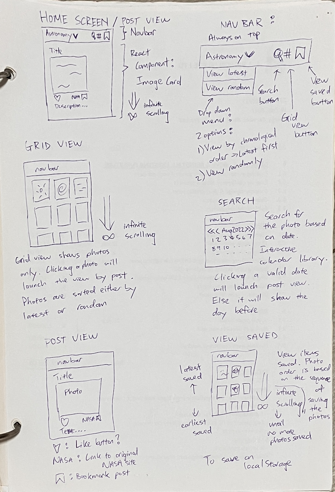
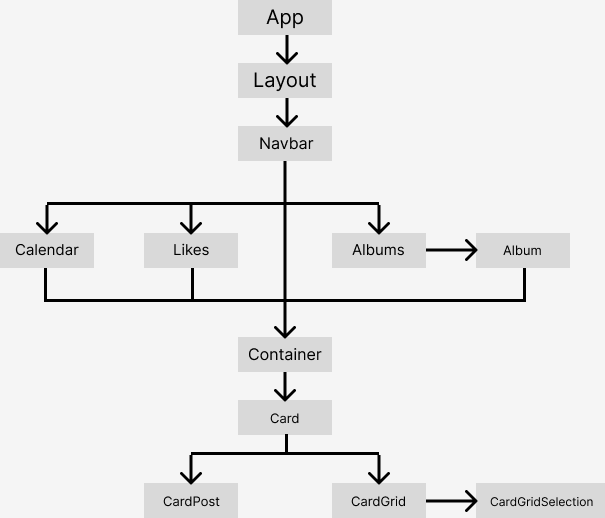

# Astronomy Photo App
An Instagram / Pinterest clone that uses NASA's APOD API to browsw astronomy photos. This is a front-end single page app that uses Airtable to store likes and albums.
It is my second project for General Assembly's Software Engineering Immersive Flex program.

## Libraries / API Used

- [React built using ViteJS](https://vitejs.dev/)
- [React router](https://reactrouter.com/en/main)
- [React datepicker](https://www.npmjs.com/package/react-datepicker)
- [React loader spinner](https://www.npmjs.com/package/react-loader-spinner)
- [Axios](https://github.com/axios/axios)
- [Tailwind CSS](https://tailwindcss.com/)
- [DaisyUI](https://daisyui.com/)
- [DayJS](https://day.js.org/)
- [Lodash](https://lodash.com/)
- [Lozad](https://apoorv.pro/lozad.js/)

- [NASA APOD API](https://github.com/nasa/apod-api)

## Features

### Latest or random photos
- View the latest photos (Latest mode)
- View random photos (Shuffle mode)

### Feed or grid view
While in latest or shuffle mode, you can view the photos either in:
- Feed mode, like Instagram
- Grid mode, like Pinterest

#### Improved user experience
When the user is scrolling through a lot of photos and wishes to switch between feed and grid, the last viewed photos will be lost as the height of the HTML body differs with feed and grid mode.

To work around this, every post HTML element has its own id, the date of post. When there is a mouseover event, the id of the element is updated to the state `lastInteraction`. (More in the section [Code]())

insert gif here

### Infinite scroll
Like these social media apps, the app has infinite scroll and you can keep scrolling down to see more photos.
(More in the section [Code]())

### Search by date
APOD releases a new photo everyday, since 1996. You can search a photo by date. Besides that photo, the app will also show you together previous photos before the search date.

### Likes and albums
You can like a photo or save it to an album. Albums have customized names and can be renamed or deleted. Likes and albums are stored on Airtable and will be retrieved when the app loads.

## Deployment

https://astronomy-photo-app.vercel.app/

## Wireframe

*Figure 1: Wireframe*

## Component Design

*Figure 2: Component Hierarchy*

## Code

### Infinite scroll
### Last interacted post

### References
https://www.digitalocean.com/community/tutorials/react-react-infinite-scroll

